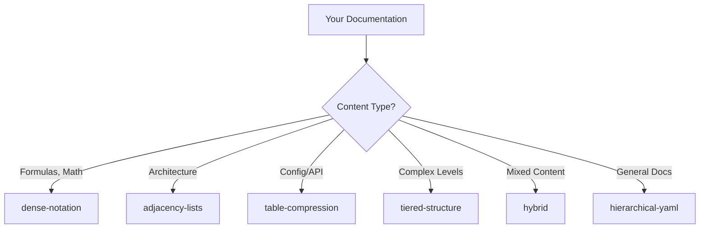

# User Guide - Documentation Compression Plugin

**Master all 6 compression strategies in 10 minutes**

---

## Table of Contents

1. [Quick Start](#quick-start)
2. [Compression Strategies](#compression-strategies)
3. [Common Use Cases](#common-use-cases)
4. [Configuration](#configuration)
5. [Quality Validation](#quality-validation)
6. [Manual Enhancement](#manual-enhancement)
7. [Best Practices](#best-practices)
8. [Troubleshooting](#troubleshooting)

---

## Quick Start

### Step 1: Compress Your First File

```javascript
// Simplest usage - use defaults
doc_compress_file({
  filePath: "/path/to/README.md"
})
```

**Output:**
```
✅ Compression complete!
   Original:   15.5 KB
   Compressed: 12.3 KB
   Ratio:      1.3x
   Output:     /path/to/COMPRESSED-README-2026-02-15.yaml
```

### Step 2: Try Auto-Detection

```javascript
// Let the plugin choose the best strategy
doc_scan_compress({
  projectPath: "/path/to/your/project",
  autoDetectStrategy: true,
  generateReport: true
})
```

**Output:**
```
📊 Analyzing content...
   Recommended strategy: hybrid
   - Formulas: 35%
   - Relationships: 45%
   - Structured Data: 20%
   - Complexity: 60%

🗜️  Compressing with hybrid...

✅ Compression complete!
   Strategy:   hybrid
   Files:      8
   Original:   120 KB
   Compressed: 28 KB
   Ratio:      4.3x
   Output:     /path/to/LLM-KNOWLEDGE-BASE-project.yaml
```

### Step 3: Enable Smart Auto-Loading (Recommended!)

Install the knowledge base loader skill for automatic, intelligent loading:

```bash
# Install the skill (one-time setup)
ln -s /path/to/plugins/doc-compression/skills/load-knowledge-base.md \
      ~/.claude/skills/

# Update KB path in skill file
# Edit: ~/.claude/skills/load-knowledge-base.md
# Line ~350: /path/to/your/LLM-KNOWLEDGE-BASE.yaml
```

**Now it auto-loads!**
```
You: "How does the routing system work?"

AI: ✅ Loaded ARCHITECTURE from knowledge base (~8KB)

The routing system works as follows:
[detailed answer from your compressed docs]

Source: Project Knowledge Base > ARCHITECTURE
```

**Benefits:**
- ✅ Auto-triggers on relevant questions (no manual load)
- ✅ Loads only needed sections (80% token savings)
- ✅ Context-aware (no redundant loads)
- ✅ Zero effort required

---

## Compression Strategies

### When to Use Which Strategy



---

### 1. Hierarchical YAML (Default)

**Best for:** General documentation, knowledge bases

**Use when:**
- You have standard markdown documentation
- Content has clear section structure
- You want balanced compression

**Example:**

```javascript
doc_compress_file({
  filePath: "/path/to/docs.md",
  strategy: "hierarchical-yaml",
  level: "medium"
})
```

**What it does:**
- Clusters sections by topic (CORE_CONCEPTS, ARCHITECTURE, etc.)
- Applies abbreviations (documentation → docs, configuration → config)
- Removes redundancy
- Creates nested YAML structure

**Before:**
```markdown
# Introduction
The system provides a comprehensive solution for...

# Configuration
Configuration can be done through the config file...
```

**After:**
```yaml
INTRODUCTION:
  desc: System provides comprehensive solution for...

CONFIGURATION:
  method: config file
  options: [...]
```

---

### 2. Dense Notation

**Best for:** Mathematical, algorithm-heavy documentation

**Use when:**
- Content has formulas or equations
- Mathematical relationships are key
- You want maximum compression

**Example:**

```javascript
doc_compress_file({
  filePath: "/path/to/algorithm-docs.md",
  strategy: "dense-notation",
  level: "aggressive"
})
```

**What it does:**
- Converts verbose descriptions to formulas
- Uses mathematical symbols (×, ÷, ∑, ∏, →)
- Generates symbol tables
- Creates compact representations

**Before:**
```markdown
Intelligence is composed of 70% instructions, 25% tools, and 5% model capability.
The complexity equals the number of nodes multiplied by the number of edges.
```

**After:**
```yaml
FORMULAS:
  Intelligence: I = Instructions(70%) × Tools(25%) × Model(5%)
  Complexity: C = N × E

SYMBOL_TABLE:
  N: nodes
  E: edges
  I: Intelligence
```

---

### 3. Adjacency Lists

**Best for:** Architecture diagrams, dependency graphs

**Use when:**
- Content describes relationships between components
- You have system architecture documentation
- Concepts and connections are key

**Example:**

```javascript
doc_compress_file({
  filePath: "/path/to/architecture.md",
  strategy: "adjacency-lists"
})
```

**What it does:**
- Extracts concepts as nodes
- Detects relationships as edges
- Creates graph notation
- Builds adjacency lists

**Before:**
```markdown
The Gateway enables routing and queue management.
The Router requires the Gateway and enables the Agent Runner.
The Agent Runner uses the Tool Registry.
```

**After:**
```yaml
NODES:
  components: [Gateway, Router, Agent_Runner, Tool_Registry]

RELATIONSHIPS:
  enables:
    Gateway: [routing, queue_management]
    Router: [Agent_Runner]
  requires:
    Router: [Gateway]
  uses:
    Agent_Runner: [Tool_Registry]
```

---

### 4. Table Compression

**Best for:** API references, configuration docs

**Use when:**
- Content has repeating structure
- You have key-value pairs
- Structured data is prominent

**Example:**

```javascript
doc_compress_file({
  filePath: "/path/to/api-reference.md",
  strategy: "table-compression"
})
```

**What it does:**
- Detects patterns
- Extracts to markdown tables
- Abbreviates headers
- Normalizes values

**Before:**
```markdown
**timeout**: The timeout value in milliseconds. Default: 5000
**retries**: Number of retry attempts. Default: 3
**interval**: Retry interval in seconds. Default: 1
```

**After:**
```yaml
TABLES:
  configuration:
    headers: [param, desc, default]
    data:
      - [timeout, timeout val (ms), 5000]
      - [retries, retry attempts, 3]
      - [interval, retry interval (s), 1]
```

---

### 5. Tiered Structure

**Best for:** Complex, multi-level documentation

**Use when:**
- Documentation has different importance levels
- You want progressive disclosure
- Content varies in detail

**Example:**

```javascript
doc_compress_file({
  filePath: "/path/to/complex-docs.md",
  strategy: "tiered-structure"
})
```

**What it does:**
- Assesses section importance
- Creates 3 tiers (Essential/Operational/Complete)
- Applies different compression per tier
- Organizes by priority

**Output Structure:**
```yaml
TIER1_ESSENTIAL:  # Maximum compression
  core_concept: "Brief definition"
  key_formula: I = Instructions × Tools × Model

TIER2_OPERATIONAL:  # Balanced
  workflow:
    - step1: "Action"
    - step2: "Next action"

TIER3_COMPLETE:  # Light compression
  detailed_examples:
    code: |
      function example() {
        // Full code preserved
      }
```

---

### 6. Hybrid (Auto-Detect)

**Best for:** Mixed content types, general use

**Use when:**
- You're not sure which strategy to use
- Content has multiple types
- You want optimal results automatically

**Example:**

```javascript
doc_compress_file({
  filePath: "/path/to/mixed-docs.md",
  strategy: "hybrid",
  level: "aggressive"
})
```

**What it does:**
- Analyzes each section
- Detects content characteristics (formulas, relationships, tables)
- Applies optimal strategy per section
- Combines results seamlessly

**How it decides:**
```
Section 1: "Architecture Overview" → adjacency-lists (45% relationships)
Section 2: "Configuration" → table-compression (60% structured data)
Section 3: "Algorithms" → dense-notation (70% formulas)
Section 4: "Examples" → hierarchical-yaml (general content)
```

---

## Common Use Cases

### Use Case 1: Compress Project README

```javascript
// Quick compression of single README
doc_compress_file({
  filePath: "/path/to/README.md",
  strategy: "hierarchical-yaml",
  level: "medium"
})

// Output: COMPRESSED-README-2026-02-15.yaml
```

**Result:** Smaller README for LLM context, preserves structure

---

### Use Case 2: Compress API Documentation

```javascript
// API docs have lots of structured data
doc_compress_folder({
  folderPath: "/path/to/api-docs",
  strategy: "table-compression",
  combineFiles: true,
  includePattern: "**/*.md"
})

// Output: LLM-KNOWLEDGE-BASE-api-docs.yaml
```

**Result:** All endpoints/params in compact tables

---

### Use Case 3: Compress Architecture Docs

```javascript
// Architecture docs have relationships
doc_compress_folder({
  folderPath: "/path/to/architecture",
  strategy: "adjacency-lists",
  combineFiles: true
})

// Output: System architecture as relationship graph
```

**Result:** Component relationships clearly mapped

---

### Use Case 4: Auto-Detect Best Strategy

```javascript
// Let the plugin decide
doc_scan_compress({
  projectPath: "/path/to/project",
  autoDetectStrategy: true,
  generateReport: true
})

// Output: Optimal compression + detailed report
```

**Result:** Best compression for your specific content

---

### Use Case 5: Compress Entire Project

```javascript
// Scan all docs, combine, compress
doc_scan_compress({
  projectPath: "/path/to/project",
  autoDetectStrategy: true,
  generateReport: true
})

// Creates:
// - LLM-KNOWLEDGE-BASE-project.yaml (compressed docs)
// - COMPRESSION-ANALYSIS.md (content analysis)
// - COMPRESSION-REPORT.md (quality metrics)
```

**Result:** Complete project knowledge base

---

## Configuration

### Project Configuration File

Create `doc-compression.config.yaml` in your project root:

```yaml
compression:
  # Default strategy to use
  defaultStrategy: hybrid

  # Compression intensity
  level: medium  # light | medium | aggressive

  # Input patterns
  input:
    include:
      - "docs/**/*.md"
      - "*.md"
      - "architecture/**/*.md"
    exclude:
      - "**/node_modules/**"
      - "**/dist/**"
      - "**/test/**"
    maxFileSizeMB: 10

  # Output settings
  output:
    format: yaml
    includeMetadata: true
    generateReport: true
    filenameTemplate: "KB-{projectName}-v{version}.yaml"

  # Quality thresholds
  validation:
    minCoverage: 0.95   # 95% minimum
    minFidelity: 0.98   # 98% minimum
    failOnLowQuality: false
```

### Override in Code

```javascript
// Config file settings are used by default
doc_compress_file({
  filePath: "/path/to/file.md"
  // Uses settings from doc-compression.config.yaml
})

// Or override per call
doc_compress_file({
  filePath: "/path/to/file.md",
  strategy: "dense-notation",  // Override strategy
  level: "aggressive"          // Override level
})
```

---

## Quality Validation

### Understanding Metrics

Every compression generates quality metrics:

```yaml
Quality Metrics:
  Fidelity: 98.3%    # Concept preservation
  Coverage: 96.1%    # Information completeness

  Details:
    Concepts: 142/145 preserved
    Relationships: 38/40 preserved
    Examples: 12/15 preserved
```

**Fidelity** = How well concepts are preserved
- ≥98% = Excellent ✅
- 90-97% = Good ⚠️
- <90% = Poor ❌

**Coverage** = How much information is represented
- ≥95% = Excellent ✅
- 85-94% = Good ⚠️
- <85% = Poor ❌

### Reading Reports

After compression with `generateReport: true`:

```markdown
# Compression Report

## Summary
- Compression Ratio: 4.3x ✅
- Fidelity: 98.1% ✅
- Coverage: 96.5% ✅

## Coverage by Section
| Section | Coverage |
|---------|----------|
| Architecture | 98% ✅ |
| Configuration | 95% ✅ |
| Examples | 92% ⚠️ |

## Recommendations
✅ Excellent compression ratio
✅ Fidelity meets target
⚠️ Examples section: consider preserveExamples: true
```

---

## Manual Enhancement

### When to Enhance Manually

Automated compression achieves 2-4x. For 6.6x+:

**Triggers:**
- Compression ratio < 3x
- You need maximum compression
- You're creating a production knowledge base

### Enhancement Techniques

#### 1. Extract Formulas

**Before (automated):**
```yaml
intelligence:
  desc: Intelligence is Instructions 70%, Tools 25%, Model 5%
```

**After (enhanced):**
```yaml
INTELLIGENCE_FORMULA:
  equation: I = Instructions(70%) × Tools(25%) × Model(5%)
  components:
    instructions: [system_prompts, context_files, skills]
    tools: [exec, read, write, search]
    model: reasoning_capability
```

**Gain:** 2-3x additional compression

---

#### 2. Create Relationship Graphs

**Before:**
```yaml
gateway:
  desc: Gateway enables routing and queue management.
    Router requires gateway.
```

**After:**
```yaml
RELATIONSHIPS:
  enables:
    gateway: [routing, queue_mgmt]
  requires:
    router: [gateway]
```

**Gain:** 2x additional compression

---

#### 3. Use Inline Objects

**Before:**
```yaml
skills:
  load_type: on_demand
  format: markdown
  trigger: keyword_matching
```

**After:**
```yaml
skills: {load: on_demand, format: markdown, trigger: keyword_matching}
```

**Gain:** 1.5x additional compression

---

#### 4. Apply Symbolic Notation

**Before:**
```yaml
modes:
  minimal:
    trigger: context usage is between 70% and 95%
```

**After:**
```yaml
modes:
  minimal:
    trigger: context_usage ∈ [70%, 95%]
```

**Gain:** 1.5x additional compression

---

### Enhancement Workflow

1. **Generate base** with plugin:
   ```javascript
   doc_compress_folder({
     folderPath: "/path/to/docs",
     strategy: "hybrid",
     level: "aggressive"
   })
   ```

2. **Review output** for patterns

3. **Apply enhancements**:
   - Extract formulas
   - Create graphs
   - Use inline objects
   - Add symbols

4. **Validate manually**:
   - Check all concepts present
   - Verify relationships accurate
   - Ensure no information lost

5. **Iterate** until satisfied

---

## Best Practices

### 1. Use the Smart Loader Skill

```bash
# ✅ Best: Install skill, let it auto-load
# See skills/README.md for setup

# Once installed:
You: "How does X work?"
AI: ✅ Auto-loads relevant section
AI: [Answers from your KB]

# Token savings: 80% vs manual full load
# Effort: Zero (automatic)
```

### 2. Strategy Selection

```javascript
// ✅ Good: Let hybrid decide for mixed content
doc_compress_file({
  filePath: "/path/to/mixed-docs.md",
  strategy: "hybrid"
})

// ❌ Bad: Force wrong strategy
doc_compress_file({
  filePath: "/path/to/api-reference.md",
  strategy: "dense-notation"  // API docs aren't math-heavy!
})

// ✅ Better: Use table compression for API docs
doc_compress_file({
  filePath: "/path/to/api-reference.md",
  strategy: "table-compression"
})
```

---

### 2. Compression Levels

```javascript
// Light: First pass, preserve everything
level: "light"  // ~1.5x, 99% fidelity

// Medium: Balanced (default)
level: "medium"  // ~2-3x, 96-98% fidelity

// Aggressive: Maximum compression
level: "aggressive"  // ~3-4x, 92-95% fidelity
```

**Recommendation:** Start with `medium`, then try `aggressive` if quality is good

---

### 3. Folder Compression

```javascript
// ✅ Good: Combine related docs
doc_compress_folder({
  folderPath: "/docs/api",
  combineFiles: true  // Single knowledge base
})

// ✅ Also good: Keep separate for different topics
doc_compress_folder({
  folderPath: "/docs",
  combineFiles: false  // One compressed file per source
})
```

---

### 4. Use Config Files

```javascript
// ❌ Bad: Hardcode settings everywhere
doc_compress_file({
  filePath: "/path/1.md",
  strategy: "hybrid",
  level: "medium",
  // ... repeat for every file
})

// ✅ Good: Use config file
// doc-compression.config.yaml:
// compression:
//   defaultStrategy: hybrid
//   level: medium

doc_compress_file({
  filePath: "/path/1.md"
  // Settings from config file
})
```

---

### 5. Validation

```javascript
// ✅ Always generate reports for important compressions
doc_scan_compress({
  projectPath: "/path/to/project",
  generateReport: true  // Get quality metrics
})

// Then review:
// - COMPRESSION-REPORT.md
// - Check fidelity and coverage
// - Apply manual enhancement if needed
```

---

## Troubleshooting

### Low Compression Ratio

**Problem:** Ratio < 2x

**Solutions:**
1. Try different strategy:
   ```javascript
   // Try hybrid instead
   strategy: "hybrid"
   ```

2. Increase compression level:
   ```javascript
   level: "aggressive"
   ```

3. Manual enhancement:
   - Follow USAGE-GUIDE.md techniques
   - Extract formulas
   - Create graphs

---

### Low Fidelity Score

**Problem:** Fidelity < 98%

**Solutions:**
1. Reduce compression:
   ```javascript
   level: "light"
   ```

2. Preserve more content:
   ```javascript
   {
     preserveCodeBlocks: true,
     preserveExamples: true
   }
   ```

3. Try different strategy:
   ```javascript
   strategy: "hierarchical-yaml"  // More conservative
   ```

---

### Missing Content

**Problem:** Important information missing

**Solutions:**
1. Check coverage report:
   - See which sections have low coverage
   - Review missing content list

2. Adjust compression:
   ```javascript
   level: "medium"  // Less aggressive
   ```

3. Manual review:
   - Add back critical information
   - Ensure key concepts included

---

### Strategy Confusion

**Problem:** Not sure which strategy to use

**Solution:** Use auto-detection!

```javascript
doc_scan_compress({
  projectPath: "/path/to/docs",
  autoDetectStrategy: true,
  generateReport: true
})

// Review the report to see:
// - Which strategy was recommended
// - Why it was chosen
// - Content characteristics
```

---

## Quick Reference

### Strategy Cheat Sheet

| Content Type | Best Strategy | Target Ratio |
|--------------|---------------|--------------|
| General docs | hierarchical-yaml | 2-4x |
| Math/algorithms | dense-notation | 3-5x |
| Architecture | adjacency-lists | 3-4x |
| API/config | table-compression | 2-3x |
| Complex levels | tiered-structure | 2-5x |
| Mixed content | hybrid | 3-6x |

### Compression Levels

| Level | Ratio | Fidelity | Use When |
|-------|-------|----------|----------|
| light | 1.5x | 99% | First pass |
| medium | 2-3x | 96-98% | Default |
| aggressive | 3-4x | 92-95% | Max compression |

### Quality Targets

| Metric | Excellent | Good | Poor |
|--------|-----------|------|------|
| Fidelity | ≥98% | 90-97% | <90% |
| Coverage | ≥95% | 85-94% | <85% |
| Ratio | ≥5x | 3-5x | <3x |

---

**Happy Compressing! 🚀**

For more examples, see `USAGE-GUIDE.md`
For setup help, see `SETUP-GUIDE.md`
